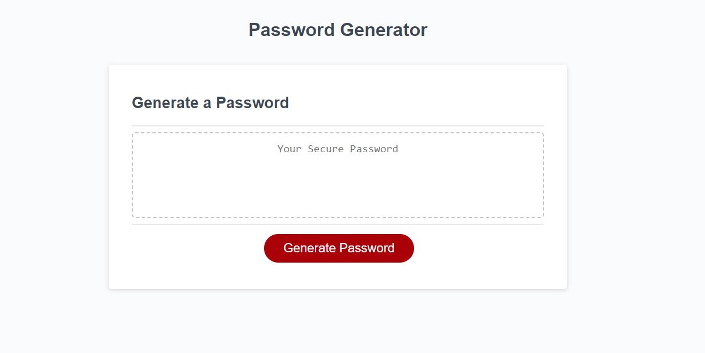

2nd rework:
fixing this error

"One issue I noted was when selecting an improper choice to generate I was getting an undefined value in the input field which you'll prob wanna fix for an even higher grade" comment from Grading Teams

Rework:

1. I have renamed the repository and site link to a more user-friendly name: "Password-Generator". 
2. Additionally, I made three more detailed commits to the main repository.
3. Furthermore, I've enriched the README file with additional details and pushed the changes to the repository.

The "Password-Generator" encompasses HTML, CSS, and JavaScript functionalities.
In the JavaScript code, I've revamped variable names to enhance their clarity:

  var lowercaseCharacters = "abcdefghijklmnopqrstuvwxyz";
  var uppercaseCharacters = "ABCDEFGHIJKLMNOPQRSTUVWXYZ";
  var numericCharacters = "0123456789";
  var specialCharacters = "!\"#$%&'()*+,-./:;<=>?@[\\]^_`{|}~"

Upon clicking the "Generate Password" button, the application validates the following conditions:

Checks if any input values are empty or if the cancel button was pressed.
Validates if the input is an integer.
Ensures that the password length is between 8 and 128 characters.
Prompts the user to select character types:

  var selectlowercaseCharacters = confirm("Do You want to Include lowercase characters?");
  var selectuppercaseCharacters = confirm("Do You want to Include uppercase characters?");
  var selectnumericCharacters = confirm("Do You want toInclude numeric characters?");
  var selectspecialCharacters = confirm("Do You want to Include special characters?");

Subsequently, the application verifies if at least one character type is selected.

Once all validations are successful, the randomly generated "password" is passed and displayed on the main page.

Live site Link

https://sagagi74.github.io/Password-Generator/

